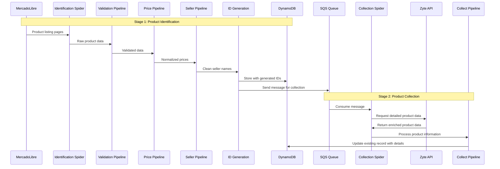
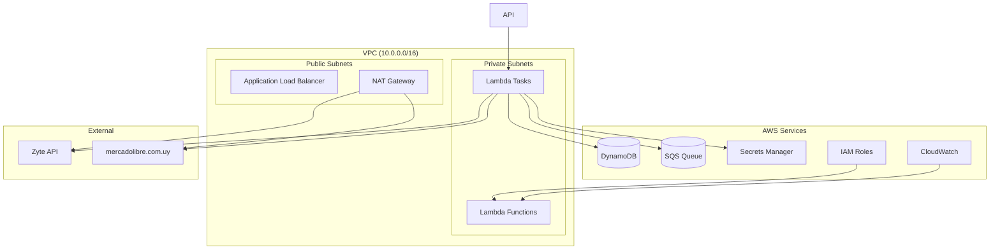

# 🏗️ Architecture Documentation

This document provides detailed architecture information for the Meli Challenge project, including system design, data flow, and component interactions.

## 📊 System Overview

The Meli Challenge system is designed as a **two-stage web scraping architecture** that processes MercadoLibre Uruguay product data through multiple stages:

1. **Identification Stage**: Discovers and catalogs product listings
2. **Collection Stage**: Extracts detailed product information
3. **Data Processing**: Validates, normalizes, and stores data
4. **Infrastructure**: AWS-based deployment and monitoring

## 🔄 Data Flow Architecture

### **High-Level Data Flow**

```
Web Sources → Spiders → Pipelines → Storage → Collection → Enrichment → Final Storage
     ↓           ↓         ↓         ↓         ↓          ↓           ↓
mercadolibre.com.uy → meli-uy-identify → Validation → DynamoDB → SQS → meli-uy-collect → Zyte API → DynamoDB Update
```

### **Detailed Data Flow Sequence**



## 🧩 Component Architecture

### **Spider Components**

#### **1. Identification Spider (`meli-uy-identify`)**
- **Purpose**: Discovers product listings from category pages
- **Input**: MercadoLibre category URLs
- **Output**: Basic product information (title, URL, seller, price)
- **Processing**: Pagination through category listings
- **Limits**: Configurable max pages and items

#### **2. Collection Spider (`meli-uy-collect`)**
- **Purpose**: Extracts detailed product information
- **Input**: SQS messages with product URLs
- **Output**: Enriched product data (features, images, description)
- **Processing**: Zyte API integration for JavaScript rendering
- **Retry Logic**: Automatic retry for failed requests

### **Pipeline Components**

#### **Pipeline Priority Order**
```
100: ValidationPipeline          - Field validation
200: PriceNormalizationPipeline - Price format conversion
300: DiscountCalculationPipeline - Discount calculations
400: ReviewsNormalizationPipeline - Review data normalization
500: SellerNormalizationPipeline - Seller name cleaning
600: CreateSellerIdUrlIdPipeline - ID generation
700: DynamoDBPipeline           - Primary storage
800: SQSPipeline                - Message queuing
950: CollectSpiderUpdatePipeline - Data enrichment
```

#### **Key Pipeline Functions**

**ValidationPipeline (Priority 100)**
- Validates required fields (title, pub_url)
- Drops items with missing or empty required fields
- Ensures data quality before processing

**PriceNormalizationPipeline (Priority 200)**
- Converts Uruguayan price format (1.234,56 → 1234.56)
- Handles various price formats and edge cases
- Sets default currency (UYU) if missing

**SellerNormalizationPipeline (Priority 500)**
- Removes "Por " prefix from seller names
- Trims whitespace and normalizes formatting
- Defaults to "no seller found" for empty values

**CreateSellerIdUrlIdPipeline (Priority 600)**
- Generates base64-encoded seller_id from seller name
- Creates SHA256 hash url_id from product URL
- Ensures unique identification for data relationships

**CollectSpiderUpdatePipeline (Priority 950)**
- Spider-specific pipeline for meli-uy-collect
- Updates specific DynamoDB columns (currency, availability, features, etc.)
- Converts Python data types to DynamoDB format

## 🗄️ Data Storage Architecture

### **DynamoDB Schema**

#### **Primary Table Structure**
```
Table: meli-products
Primary Key: seller_id (String, Partition Key)
Sort Key: url_id (String, Sort Key)

Attributes:
- title (String)
- pub_url (String)
- seller (String)
- price (Number)
- currency (String)
- original_price (Number)
- discount_percentage (Number)
- discount_amount (Number)
- reviews_count (Number)
- rating (Number)
- availability (String)
- features (List)
- images (List)
- mainImage (Map)
- description (String)
- inserted_at (String)
- updated_at (String)
```

#### **Data Relationships**
```
seller_id (Partition Key) → Groups products by seller
url_id (Sort Key) → Unique product within seller
```

### **SQS Message Structure**

#### **Message Format**
```json
{
  "seller_id": "base64_encoded_seller_name",
  "url_id": "sha256_hash_of_url",
  "inserted_at": "2024-01-01T00:00:00Z"
}
```

#### **Message Processing**
- **Visibility Timeout**: 30 seconds
- **Message Retention**: 4 days
- **Batch Size**: Configurable (default: 10 messages)
- **Dead Letter Queue**: Failed message handling

## ☁️ Infrastructure Architecture

### **AWS Service Architecture**



### **Lambda Function Definition**

#### **Container Configuration**
```yaml
Container: meli-crawler
Image: ghcr.io/OWNER/meli-challenge:latest
CPU: 1024 (1 vCPU)
Memory: 2048 MB
Port: 8000

Environment Variables:
- SCRAPY_LOG_LEVEL: INFO
- MAX_PAGES: 50
- MAX_ITEMS: 5000
- MAX_BATCHES: 100
- MAX_MESSAGES_PER_BATCH: 10
- MAX_RETRIES: 3

Secrets (from AWS Secrets Manager):
- AWS_ACCESS_KEY_ID
- AWS_SECRET_ACCESS_KEY
- DYNAMODB_TABLE_NAME
- SQS_QUEUE_URL
- ZYTE_API_KEY
```

#### **Auto-scaling Configuration**
```
CPU Target: 70%
Memory Target: 80%
Min Capacity: 1 task
Max Capacity: 10 tasks
Scale-in Cooldown: 300 seconds
Scale-out Cooldown: 60 seconds
```

## 🔐 Security Architecture

### **IAM Roles and Permissions**

#### **Task Execution Role**
```json
{
  "Version": "2012-10-17",
  "Statement": [
    {
      "Effect": "Allow",
      "Action": [
        "ecr:GetAuthorizationToken",
        "ecr:BatchCheckLayerAvailability",
        "ecr:GetDownloadUrlForLayer",
        "ecr:BatchGetImage"
      ],
      "Resource": "*"
    },
    {
      "Effect": "Allow",
      "Action": [
        "logs:CreateLogStream",
        "logs:PutLogEvents"
      ],
      "Resource": "*"
    }
  ]
}
```

#### **Task Role**
```json
{
  "Version": "2012-10-17",
  "Statement": [
    {
      "Effect": "Allow",
      "Action": [
        "dynamodb:GetItem",
        "dynamodb:PutItem",
        "dynamodb:UpdateItem",
        "dynamodb:DeleteItem"
      ],
      "Resource": "arn:aws:dynamodb:*:*:table/meli-products"
    },
    {
      "Effect": "Allow",
      "Action": [
        "sqs:ReceiveMessage",
        "sqs:DeleteMessage",
        "sqs:SendMessage"
      ],
      "Resource": "arn:aws:sqs:*:*:meli-queue"
    },
    {
      "Effect": "Allow",
      "Action": [
        "secretsmanager:GetSecretValue"
      ],
      "Resource": "arn:aws:secretsmanager:*:*:secret/meli-*"
    }
  ]
}
```

### **Network Security**

#### **Security Groups**
```
Lambda Security Group:
- Inbound: None (private subnet)
- Outbound: All traffic (0.0.0.0/0)

ALB Security Group:
- Inbound: HTTPS (443) from 0.0.0.0/0
- Outbound: All traffic to Lambda security group
```

#### **VPC Configuration**
```
VPC CIDR: 10.0.0.0/16
Public Subnets: 10.0.1.0/24, 10.0.2.0/24
Private Subnets: 10.0.10.0/24, 10.0.20.0/24
NAT Gateway: For private subnet internet access
```

## 📊 Monitoring and Observability

### **CloudWatch Metrics**

#### **Lambda Function Metrics**
- **CPU Utilization**: Target 70% for scaling
- **Memory Utilization**: Target 80% for scaling
- **Network I/O**: Bytes sent/received
- **Task Count**: Running task count

#### **Application Metrics**
- **Items Processed**: Count per pipeline stage
- **Processing Time**: Average processing duration
- **Error Rate**: Failed items percentage
- **Queue Depth**: SQS message count

#### **Custom Metrics**
```python
# Example custom metric
import boto3

cloudwatch = boto3.client('cloudwatch')

def record_metric(metric_name, value, unit='Count'):
    cloudwatch.put_metric_data(
        Namespace='MeliChallenge',
        MetricData=[{
            'MetricName': metric_name,
            'Value': value,
            'Unit': unit,
            'Timestamp': datetime.utcnow()
        }]
    )

# Usage in pipelines
record_metric('ItemsProcessed', 1)
record_metric('ProcessingTime', processing_time, 'Seconds')
```

### **Logging Strategy**

#### **Log Levels**
```
DEBUG: Detailed debugging information
INFO: General operational information
WARNING: Warning messages for potential issues
ERROR: Error messages for failed operations
CRITICAL: Critical errors requiring immediate attention
```

#### **Log Format**
```python
import logging

logging.basicConfig(
    format='%(asctime)s [%(levelname)s] %(name)s: %(message)s',
    level=logging.INFO
)

# Spider logging
self.logger.info(f"Processing URL: {url}")
self.logger.warning(f"Retry attempt {retry_count} for {url}")
self.logger.error(f"Failed to process {url}: {error}")

# Pipeline logging
self.logger.info(f"Processing item: {item.get('title', 'Unknown')}")
self.logger.debug(f"Pipeline result: {result}")
```

## 🚀 Performance Architecture

### **Scaling Strategies**

#### **Horizontal Scaling**
- **Lambda Concurrency Auto-scaling**: Based on invocation metrics
- **Task Distribution**: Multiple tasks across availability zones
- **Load Balancing**: ALB for traffic distribution

#### **Vertical Scaling**
- **Task Resources**: Configurable CPU/Memory allocation
- **Instance Types**: Fargate CPU/Memory combinations
- **Resource Limits**: Per-task resource constraints

### **Performance Optimization**

#### **Concurrency Settings**
```python
# Scrapy settings
CONCURRENT_REQUESTS = 16          # Concurrent requests per domain
CONCURRENT_REQUESTS_PER_DOMAIN = 8
DOWNLOAD_DELAY = 1                # Delay between requests
RANDOMIZE_DOWNLOAD_DELAY = 0.5    # Randomize delay

# Spider-specific settings
custom_settings = {
    'CONCURRENT_REQUESTS': 32,     # Override for specific spiders
    'DOWNLOAD_DELAY': 0.5,
}
```

#### **Caching and Optimization**
```python
# HTTP caching
HTTPCACHE_ENABLED = True
HTTPCACHE_EXPIRATION_SECS = 3600  # 1 hour
HTTPCACHE_DIR = 'httpcache'

# Memory optimization
MEMUSAGE_ENABLED = True
MEMUSAGE_LIMIT_MB = 2048
```

## 🔄 Deployment Architecture

### **CI/CD Pipeline**

#### **GitHub Actions Workflow**
```yaml
name: CI/CD Pipeline
on:
  push:
    branches: [main, develop]
  pull_request:
    branches: [main, develop]

jobs:
  test:
    runs-on: ubuntu-latest
    steps:
      - uses: actions/checkout@v3
      - name: Run Tests
        run: make test

  build:
    needs: test
    runs-on: ubuntu-latest
    steps:
      - name: Setup Serverless Framework
run: npm install

  deploy:
    needs: build
    runs-on: ubuntu-latest
    steps:
      - name: Deploy to AWS
        run: ./deploy.sh --environment production
```

#### **Deployment Strategy**
1. **Blue-Green Deployment**: Zero-downtime deployments
2. **Rolling Updates**: Gradual task replacement
3. **Health Checks**: Post-deployment validation
4. **Rollback Capability**: Quick rollback on failures

### **Environment Management**

#### **Environment Separation**
```
Development:
- Lambda Functions: meli-challenge-dev
- DynamoDB Table: meli-products-dev
- SQS Queue: meli-queue-dev
- Log Level: DEBUG

Staging:
- Lambda Functions: meli-challenge-staging
- DynamoDB Table: meli-products-staging
- SQS Queue: meli-queue-staging
- Log Level: INFO

Production:
- Lambda Functions: meli-challenge-production
- DynamoDB Table: meli-products-production
- SQS Queue: meli-queue-production
- Log Level: WARNING
```

## 🔧 Configuration Management

### **Environment Variables**

#### **Required Variables**
```bash
# AWS Configuration
AWS_ACCESS_KEY_ID=your_access_key
AWS_SECRET_ACCESS_KEY=your_secret_key
AWS_DEFAULT_REGION=us-east-1

# Service Configuration
DYNAMODB_TABLE_NAME=meli-products
SQS_QUEUE_URL=https://sqs.region.amazonaws.com/queue-url
ZYTE_API_KEY=your_zyte_api_key

# Scrapy Configuration
SCRAPY_LOG_LEVEL=INFO
SCRAPY_CONCURRENT_REQUESTS=16
SCRAPY_DOWNLOAD_DELAY=1
```

#### **Optional Variables**
```bash
# Spider Limits
MAX_PAGES=20
MAX_ITEMS=2000
MAX_BATCHES=100
MAX_MESSAGES_PER_BATCH=10
MAX_RETRIES=3

# Performance Tuning
SCRAPY_CONCURRENT_REQUESTS_PER_DOMAIN=8
SCRAPY_RANDOMIZE_DOWNLOAD_DELAY=0.5
SCRAPY_HTTPCACHE_ENABLED=True
```

### **Configuration Files**

#### **Scrapy Settings**
```python
# settings.py
BOT_NAME = 'meli_crawler'
SPIDER_MODULES = ['meli_crawler.spiders']
NEWSPIDER_MODULE = 'meli_crawler.spiders'

# Crawler settings
ROBOTSTXT_OBEY = False
COOKIES_ENABLED = False
DOWNLOAD_DELAY = 1
RANDOMIZE_DOWNLOAD_DELAY = 0.5

# Pipeline configuration
ITEM_PIPELINES = {
    'meli_crawler.pipelines.ValidationPipeline': 100,
    'meli_crawler.pipelines.PriceNormalizationPipeline': 200,
    # ... more pipelines
}
```

#### **Serverless Configuration**
```yaml
# serverless.yml
FROM python:3.11-slim
WORKDIR /app
COPY pyproject.toml uv.lock ./
RUN uv pip install -e .
COPY . .
CMD ["python", "run_spiders.py"]
```

## 📈 Future Architecture Considerations

### **Scalability Improvements**
- **Multi-region Deployment**: Geographic distribution
- **Database Sharding**: Horizontal DynamoDB scaling
- **Microservices**: Service decomposition
- **Event-driven Architecture**: SNS/SQS event patterns

### **Advanced Features**
- **Machine Learning**: Product categorization and pricing analysis
- **Real-time Processing**: Kinesis stream processing
- **Advanced Analytics**: Athena/QuickSight integration
- **API Gateway**: RESTful API endpoints

### **Monitoring Enhancements**
- **Distributed Tracing**: X-Ray integration
- **Custom Dashboards**: CloudWatch custom dashboards
- **Alerting**: SNS-based alerting system
- **Performance Profiling**: Detailed performance metrics

---

This architecture provides a robust, scalable foundation for web scraping operations with comprehensive monitoring, security, and deployment capabilities.
