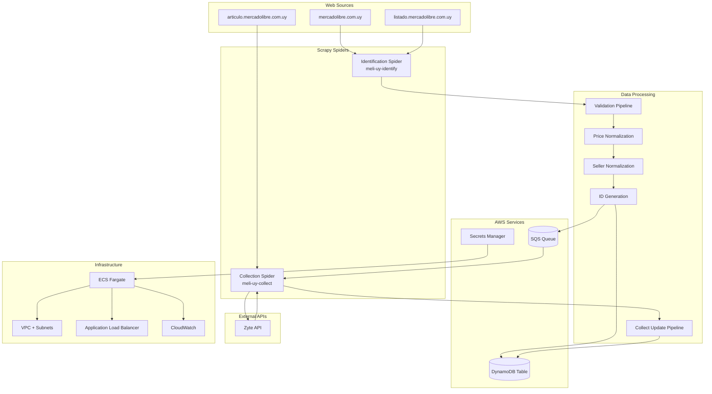
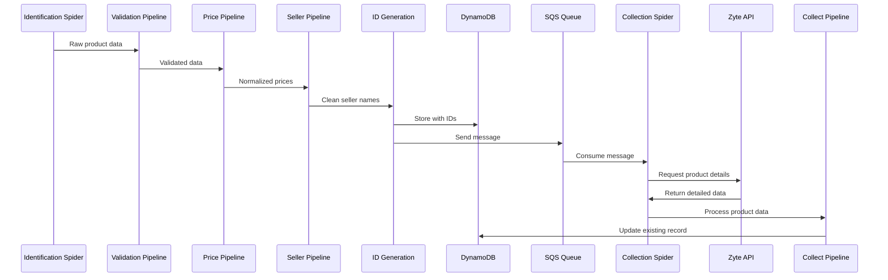
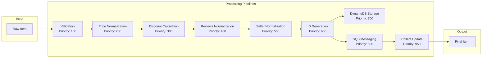

# 🚀 Meli Challenge - Scrapy Web Scraping Project

A comprehensive web scraping solution for MercadoLibre Uruguay using Scrapy, AWS services, and modern DevOps practices.

## 📋 Table of Contents

- [Overview](#overview)
- [Architecture](#architecture)
- [Features](#features)
- [Prerequisites](#prerequisites)
- [Quick Start](#quick-start)
- [Project Structure](#project-structure)
- [Configuration](#configuration)
- [Usage Examples](#usage-examples)
- [Testing](#testing)
- [Deployment](#deployment)
- [Monitoring](#monitoring)
- [Contributing](#contributing)
- [Troubleshooting](#troubleshooting)

## 🎯 Overview

Meli Challenge is a production-ready web scraping system designed to extract product information from MercadoLibre Uruguay. The project implements a two-stage scraping architecture:

1. **Identification Stage**: Discovers and catalogs product listings
2. **Collection Stage**: Extracts detailed product information using Zyte API

The system integrates with AWS services (DynamoDB, SQS) for data storage and message queuing, with comprehensive testing, Docker containerization, and CI/CD pipeline deployment.

## 🏗️ Architecture

### **System Architecture Diagram**



### **Data Flow Architecture**



### **Pipeline Architecture**



## ✨ Features

### **Core Functionality**
- 🔍 **Dual-Stage Scraping**: Identification + Collection phases
- 📊 **Data Validation**: Comprehensive field validation and cleaning
- 💰 **Price Normalization**: Uruguayan price format handling
- 👤 **Seller Normalization**: Clean seller name processing
- 🆔 **ID Generation**: Base64 seller IDs + SHA256 URL hashes
- 🔄 **Retry Logic**: Automatic retry for failed requests
- 📝 **Logging**: Comprehensive logging and monitoring

### **AWS Integration**
- 🗄️ **DynamoDB**: Primary data storage with optimized schemas
- 📨 **SQS**: Message queuing for asynchronous processing
- 🔐 **Secrets Manager**: Secure credential management
- ☁️ **ECS Fargate**: Containerized deployment
- 📊 **CloudWatch**: Monitoring and alerting

### **Advanced Features**
- 🌐 **Zyte API Integration**: Browser emulation and JavaScript rendering
- 🐳 **Docker Containerization**: Consistent deployment environments
- 🧪 **Comprehensive Testing**: Unit, integration, and performance tests
- 🚀 **CI/CD Pipeline**: Automated testing and deployment
- 📈 **Auto-scaling**: ECS service auto-scaling based on metrics
- 🔒 **Security**: IAM roles, VPC isolation, HTTPS endpoints

## 📋 Prerequisites

### **Required Software**
- **Python 3.11+**
- **Docker & Docker Compose**
- **AWS CLI** (for deployment)
- **Terraform** (for infrastructure)
- **uv** (Python package manager)

### **Required AWS Services**
- **AWS Account** with appropriate permissions
- **DynamoDB Table** for data storage
- **SQS Queue** for message processing
- **ECS Cluster** for container deployment
- **Secrets Manager** for credentials

### **Required API Keys**
- **Zyte API Key** for web scraping
- **AWS Access Keys** for service integration

## 🚀 Quick Start

### **1. Clone and Setup**

```bash
# Clone the repository
git clone <your-repo-url>
cd meli-challenge

# Install dependencies
uv pip install -e .

# Setup environment
cp env.example .env
# Edit .env with your credentials
```

### **2. Run with Docker (Recommended)**

```bash
# Setup Docker environment
./setup-docker.sh

# Start the application
make up

# Check status
make status

# View logs
make logs
```

### **3. Run Locally**

```bash
# Install dependencies
uv pip install -r requirements.txt

# Run identification spider
scrapy crawl meli-uy-identify

# Run collection spider
scrapy crawl meli-uy-collect
```

## 📁 Project Structure

```
meli-challenge/
├── 📁 meli_crawler/              # Main Scrapy project
│   ├── 📁 spiders/               # Spider definitions
│   │   ├── meli_uy_identify.py  # Product identification spider
│   │   └── meli_uy_collect.py   # Product collection spider
│   ├── 📁 pipelines/             # Data processing pipelines
│   ├── 📁 middlewares/           # Request/response middleware
│   ├── 📁 utils/                 # Utility functions
│   └── settings.py               # Scrapy configuration
├── 📁 tests/                     # Comprehensive test suite
│   ├── test_spiders.py           # Spider unit tests
│   ├── test_pipelines.py         # Pipeline unit tests
│   ├── test_integration.py       # Integration tests
│   └── test_utils.py             # Test utilities
├── 📁 infrastructure/            # Terraform IaC
│   ├── main.tf                   # Main infrastructure
│   └── 📁 modules/               # Reusable modules
├── 📁 .aws/                      # AWS task definitions
├── 📁 .github/                   # GitHub Actions CI/CD
├── 🐳 Dockerfile                 # Container definition
├── 🐳 docker-compose.yml         # Local development
├── 🐳 docker-compose.override.yml # Development overrides
├── 📋 Makefile                   # Build automation
├── 🚀 deploy.sh                  # Deployment script
└── 📖 README.md                  # This file
```

## ⚙️ Configuration

### **Environment Variables**

```bash
# AWS Configuration
AWS_ACCESS_KEY_ID=your_access_key
AWS_SECRET_ACCESS_KEY=your_secret_key
AWS_DEFAULT_REGION=us-east-1

# DynamoDB Configuration
DYNAMODB_TABLE_NAME=meli-products

# SQS Configuration
SQS_QUEUE_URL=https://sqs.region.amazonaws.com/queue-url

# Zyte API Configuration
ZYTE_API_KEY=your_zyte_api_key

# Scrapy Configuration
SCRAPY_LOG_LEVEL=INFO
SCRAPY_CONCURRENT_REQUESTS=16
SCRAPY_DOWNLOAD_DELAY=1
```

### **Spider Configuration**

#### **Identification Spider (`meli-uy-identify`)**
```python
class MeliUyIdentifySpider(scrapy.Spider):
    name = 'meli-uy-identify'
    max_pages = 20          # Maximum pages to scrape
    max_items = 2000        # Maximum items to process
    allowed_domains = ['mercadolibre.com.uy']
    
    custom_settings = {
        'ITEM_PIPELINES': {
            'meli_crawler.pipelines.ValidationPipeline': 100,
            'meli_crawler.pipelines.PriceNormalizationPipeline': 200,
            # ... more pipelines
        }
    }
```

#### **Collection Spider (`meli-uy-collect`)**
```python
class MeliUyCollectSpider(scrapy.Spider):
    name = 'meli-uy-collect'
    max_batches = 100              # Maximum SQS batches
    max_messages_per_batch = 10    # Messages per batch
    max_retries = 3                # Retry attempts
    
    custom_settings = {
        'ADDONS': {
            'scrapy_zyte_api.Addon': None
        },
        'ZYTE_API_TRANSPARENT_MODE': True,
        'ZYTE_API_BROWSER_HEADERS': True
    }
```

## 💻 Usage Examples

### **Running Spiders**

#### **Basic Spider Execution**
```bash
# Run identification spider
scrapy crawl meli-uy-identify

# Run collection spider
scrapy crawl meli-uy-collect

# Run with custom settings
scrapy crawl meli-uy-identify -s MAX_PAGES=10 -s MAX_ITEMS=500
```

#### **Spider with Parameters**
```bash
# Run with custom limits
scrapy crawl meli-uy-identify \
  -a max_pages=5 \
  -a max_items=100 \
  -s LOG_LEVEL=DEBUG

# Run collection spider with retry settings
scrapy crawl meli-uy-collect \
  -a max_batches=50 \
  -a max_messages_per_batch=5 \
  -a max_retries=5
```

### **Docker Commands**

#### **Development Mode**
```bash
# Start development environment
make dev-up

# View development logs
make dev-logs

# Access development shell
make dev-shell

# Stop development environment
make dev-down
```

#### **Production Mode**
```bash
# Start production environment
make prod-up

# View production logs
make prod-logs

# Check production status
make status

# Stop production environment
make prod-down
```

### **Makefile Commands**

```bash
# Build and run
make build          # Build Docker image
make up            # Start services
make down          # Stop services
make restart       # Restart services

# Development
make dev-up        # Start development environment
make dev-shell     # Access development container
make dev-logs      # View development logs

# Testing
make test          # Run all tests
make test-unit     # Run unit tests only
make test-coverage # Run tests with coverage
make test-report   # Generate test report

# Deployment
make deploy        # Deploy to AWS
make clean         # Clean build artifacts
```

### **Pipeline Usage**

#### **Custom Pipeline Configuration**
```python
# In your spider
custom_settings = {
    'ITEM_PIPELINES': {
        'meli_crawler.pipelines.ValidationPipeline': 100,
        'meli_crawler.pipelines.CustomPipeline': 150,
        'meli_crawler.pipelines.DynamoDBPipeline': 700,
    }
}
```

#### **Pipeline Data Flow**
```python
# Raw item from spider
raw_item = {
    'title': '  Test Product  ',
    'pub_url': 'https://mercadolibre.com.uy/product/123',
    'seller': 'Por Test Seller',
    'price': '1.234,56'
}

# After validation pipeline
validated_item = {
    'title': '  Test Product  ',
    'pub_url': 'https://mercadolibre.com.uy/product/123',
    'seller': 'Por Test Seller',
    'price': '1.234,56'
}

# After price normalization
price_normalized_item = {
    'title': '  Test Product  ',
    'pub_url': 'https://mercadolibre.com.uy/product/123',
    'seller': 'Por Test Seller',
    'price': 1234.56,
    'currency': 'UYU'
}

# After seller normalization
seller_normalized_item = {
    'title': '  Test Product  ',
    'pub_url': 'https://mercadolibre.com.uy/product/123',
    'seller': 'Test Seller',
    'price': 1234.56,
    'currency': 'UYU'
}

# After ID generation
final_item = {
    'title': '  Test Product  ',
    'pub_url': 'https://mercadolibre.com.uy/product/123',
    'seller': 'Test Seller',
    'price': 1234.56,
    'currency': 'UYU',
    'seller_id': 'VGVzdCBTZWxsZXI=',  # Base64 encoded
    'url_id': 'a1b2c3d4...'          # SHA256 hash
}
```

## 🧪 Testing

### **Running Tests**

```bash
# Run all tests
make test

# Run specific test categories
make test-unit          # Unit tests
make test-spiders       # Spider tests
make test-pipelines     # Pipeline tests
make test-integration   # Integration tests

# Run with coverage
make test-coverage

# Generate test report
make test-report

# List all tests
make test-list
```

### **Test Structure**

```
tests/
├── test_spiders.py      # Spider unit tests
├── test_pipelines.py    # Pipeline unit tests
├── test_integration.py  # Integration tests
├── test_utils.py        # Test utilities
├── test_config.py       # Test configuration
└── run_tests.py         # Test runner
```

### **Example Test**

```python
def test_seller_normalization(self):
    """Test seller name normalization"""
    item = {'seller': 'Por Test Seller'}
    result = self.pipeline.process_item(item, self.spider)
    self.assertEqual(result['seller'], 'Test Seller')

def test_price_normalization(self):
    """Test price format conversion"""
    item = {'price': '1.234,56'}
    result = self.pipeline.process_item(item, self.spider)
    self.assertEqual(result['price'], 1234.56)
```

## 🚀 Deployment

### **AWS Deployment**

#### **1. Infrastructure Setup**
```bash
# Initialize Terraform
cd infrastructure
terraform init

# Plan deployment
terraform plan -var="environment=staging"

# Apply infrastructure
terraform apply -var="environment=staging"
```

#### **2. Application Deployment**
```bash
# Deploy application
./deploy.sh --environment staging --region us-east-1

# Check deployment status
aws ecs describe-services \
  --cluster meli-crawler-staging \
  --services meli-crawler-staging
```

#### **3. CI/CD Pipeline**
The project includes GitHub Actions workflows for:
- **Automated Testing**: Unit tests, integration tests, security scans
- **Docker Builds**: Multi-platform image building
- **AWS Deployment**: Automatic deployment to staging/production
- **Monitoring**: Post-deployment health checks

### **Docker Deployment**

#### **Production Docker Compose**
```yaml
version: '3.8'
services:
  meli-crawler:
    build: .
    environment:
      - SCRAPY_LOG_LEVEL=INFO
      - MAX_PAGES=50
      - MAX_ITEMS=5000
    restart: unless-stopped
    healthcheck:
      test: ["CMD", "python", "healthcheck.py"]
      interval: 30s
      timeout: 10s
      retries: 3
```

#### **Health Check**
```python
# healthcheck.py
import sys
import importlib

def check_dependencies():
    required_modules = ['scrapy', 'boto3', 'decouple']
    for module in required_modules:
        try:
            importlib.import_module(module)
        except ImportError:
            return False
    return True

if __name__ == '__main__':
    if check_dependencies():
        sys.exit(0)
    else:
        sys.exit(1)
```

## 📊 Monitoring

### **CloudWatch Metrics**

- **ECS Service Metrics**: CPU, Memory, Network
- **Application Metrics**: Request count, error rate, latency
- **Custom Metrics**: Items processed, pipeline success rate

### **Logging**

```python
# Spider logging
self.logger.info(f"Processing URL: {url}")
self.logger.warning(f"Retry attempt {retry_count} for {url}")
self.logger.error(f"Failed to process {url}: {error}")

# Pipeline logging
self.logger.info(f"Processing item: {item.get('title', 'Unknown')}")
self.logger.debug(f"Pipeline result: {result}")
```

### **Health Checks**

```bash
# Check ECS service health
aws ecs describe-services \
  --cluster meli-crawler-production \
  --services meli-crawler-production

# Check DynamoDB table status
aws dynamodb describe-table \
  --table-name meli-products

# Check SQS queue status
aws sqs get-queue-attributes \
  --queue-url $SQS_QUEUE_URL \
  --attribute-names All
```

## 🔧 Troubleshooting

### **Common Issues**

#### **1. Import Errors**
```bash
# Error: No module named 'meli_crawler'
# Solution: Install in development mode
uv pip install -e .
```

#### **2. AWS Credentials**
```bash
# Error: Unable to locate credentials
# Solution: Configure AWS CLI
aws configure
# or set environment variables
export AWS_ACCESS_KEY_ID=your_key
export AWS_SECRET_ACCESS_KEY=your_secret
```

#### **3. DynamoDB Errors**
```bash
# Error: Parameter validation failed
# Solution: Check data types in pipelines
# Ensure proper DynamoDB format conversion
```

#### **4. SQS Message Processing**
```bash
# Error: Messages not being consumed
# Solution: Check queue permissions
# Verify message format and structure
```

### **Debug Commands**

```bash
# Check spider status
scrapy list

# Run spider with debug output
scrapy crawl meli-uy-identify -L DEBUG

# Check pipeline processing
scrapy crawl meli-uy-identify -s LOG_LEVEL=DEBUG

# Test specific pipeline
python -c "
from meli_crawler.pipelines import ValidationPipeline
pipeline = ValidationPipeline()
print(pipeline.process_item({'title': 'test'}, None))
"
```

### **Performance Tuning**

```bash
# Increase concurrency
scrapy crawl meli-uy-identify -s CONCURRENT_REQUESTS=32

# Reduce download delay
scrapy crawl meli-uy-identify -s DOWNLOAD_DELAY=0.5

# Enable caching
scrapy crawl meli-uy-identify -s HTTPCACHE_ENABLED=True
```

## 🤝 Contributing

### **Development Workflow**

1. **Fork the repository**
2. **Create a feature branch**: `git checkout -b feature/amazing-feature`
3. **Make your changes**
4. **Add tests** for new functionality
5. **Run tests**: `make test`
6. **Commit changes**: `git commit -m 'Add amazing feature'`
7. **Push to branch**: `git push origin feature/amazing-feature`
8. **Create a Pull Request**

### **Code Standards**

- **Python**: Follow PEP 8 style guide
- **Tests**: Maintain >90% code coverage
- **Documentation**: Update README and docstrings
- **Commits**: Use conventional commit messages

### **Testing Requirements**

```bash
# All tests must pass
make test

# Code coverage must be >90%
make test-coverage

# No linting errors
flake8 meli_crawler/
black --check meli_crawler/
```

## 📚 Additional Resources

### **Documentation**
- [Scrapy Documentation](https://docs.scrapy.org/)
- [AWS ECS Documentation](https://docs.aws.amazon.com/ecs/)
- [Terraform Documentation](https://www.terraform.io/docs)
- [Docker Documentation](https://docs.docker.com/)

### **Related Projects**
- [Scrapy-Zyte-API](https://github.com/scrapy-plugins/scrapy-zyte-api)
- [Boto3 Documentation](https://boto3.amazonaws.com/v1/documentation/api/latest/index.html)
- [Python Decouple](https://github.com/henriquebastos/python-decouple)

### **Community**
- [Scrapy Community](https://scrapy.org/community/)
- [AWS Developer Community](https://aws.amazon.com/developer/)
- [Terraform Community](https://www.terraform.io/community)

## 📄 License

This project is licensed under the MIT License - see the [LICENSE](LICENSE) file for details.

## 🙏 Acknowledgments

- **Scrapy Team** for the excellent web scraping framework
- **AWS** for cloud infrastructure services
- **Zyte** for the powerful web scraping API
- **Open Source Community** for various tools and libraries

---

**Happy Scraping! 🕷️✨**

For questions and support, please open an issue in the repository or contact the development team.
